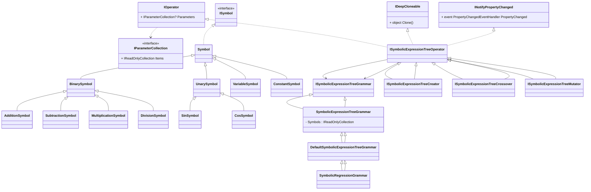

```mermaid
classDiagram
    %% Core Abstractions
    class IOperator {
      + IParameterCollection? Parameters
    }
    class IDeepCloneable {
      + object Clone()
    }
    class INotifyPropertyChanged {
      + event PropertyChangedEventHandler PropertyChanged
    }
    class IParameterCollection {
      <<interface>>
      + IReadOnlyCollection<IParameter> Items
    }

    IOperator <|.. ISymbolicExpressionTreeOperator
    IDeepCloneable <|.. ISymbolicExpressionTreeOperator
    INotifyPropertyChanged <|.. ISymbolicExpressionTreeOperator
    IOperator ..> IParameterCollection

    %% Symbol Interfaces & Classes
    class ISymbol {
      <<interface>>
    }
    ISymbol <|.. Symbol
    class BinarySymbol
    class AdditionSymbol
    class SubtractionSymbol
    class MultiplicationSymbol
    class DivisionSymbol
    class UnarySymbol
    class SinSymbol
    class CosSymbol
    class VariableSymbol
    class ConstantSymbol

    Symbol <|-- BinarySymbol
    Symbol <|-- UnarySymbol
    Symbol <|-- VariableSymbol
    Symbol <|-- ConstantSymbol
    BinarySymbol <|-- AdditionSymbol
    BinarySymbol <|-- SubtractionSymbol
    BinarySymbol <|-- MultiplicationSymbol
    BinarySymbol <|-- DivisionSymbol
    UnarySymbol <|-- SinSymbol
    UnarySymbol <|-- CosSymbol

    %% Grammars
    class SymbolicExpressionTreeGrammar {
      - Symbols : IReadOnlyCollection<ISymbol>
    }
    class DefaultSymbolicExpressionTreeGrammar
    class SymbolicRegressionGrammar

    ISymbolicExpressionTreeGrammar <|-- SymbolicExpressionTreeGrammar
    SymbolicExpressionTreeGrammar <|-- DefaultSymbolicExpressionTreeGrammar
    DefaultSymbolicExpressionTreeGrammar <|-- SymbolicRegressionGrammar

    %% Operators
    ISymbolicExpressionTreeOperator --> ISymbolicExpressionTreeGrammar
    ISymbolicExpressionTreeOperator <|-- ISymbolicExpressionTreeCreator
    ISymbolicExpressionTreeOperator <|-- ISymbolicExpressionTreeCrossover
    ISymbolicExpressionTreeOperator <|-- ISymbolicExpressionTreeMutator
    class DefaultSymbolicExpressionTreeGrammar
    class SymbolicRegressionGrammar

    ISymbolicExpressionTreeGrammar <|-- SymbolicExpressionTreeGrammar
    SymbolicExpressionTreeGrammar <|-- DefaultSymbolicExpressionTreeGrammar
    DefaultSymbolicExpressionTreeGrammar <|-- SymbolicRegressionGrammar

    %% Operators
    ISymbolicExpressionTreeOperator --> ISymbolicExpressionTreeGrammar
    ISymbolicExpressionTreeOperator <|-- ISymbolicExpressionTreeCreator
    ISymbolicExpressionTreeOperator <|-- ISymbolicExpressionTreeCrossover
    ISymbolicExpressionTreeOperator <|-- ISymbolicExpressionTreeMutator
```