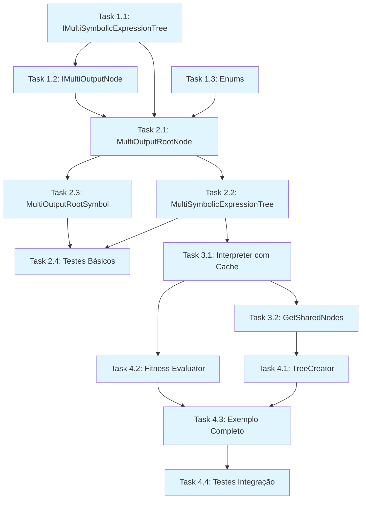

# Plano de Execução - Etapa 2: Multi-Output Simplificado

## 📋 Visão Geral do Plano

**Objetivo**: Implementar suporte a múltiplas saídas homogêneas com arquitetura simplificada  
**Estratégia**: Desenvolvimento incremental com checkpoints funcionais  
**Duração Estimada**: 6-8 horas (reduzido devido à simplificação)  
**Complexidade**: Baixa - usa operadores existing + cache inteligente

## 🎯 Checkpoints e Dependências

```
CHECKPOINT 1: Core Interfaces ──→ CHECKPOINT 2: Basic Implementation ──→ CHECKPOINT 3: Cache System ──→ CHECKPOINT 4: Complete System
     ↓                                ↓                                    ↓                                ↓
   Task 1.1-1.3                   Task 2.1-2.4                       Task 3.1-3.2                        Task 4.1-4.4
   (2 horas)                      (2 horas)                          (1.5 horas)                        (1.5 horas)
```

## 📈 Estrutura de Tasks

### **CHECKPOINT 1: Core Interfaces** 🚀
**Objetivo**: Definir interfaces básicas e estrutura fundamental  
**Duração**: 2 horas  
**Estado Final**: Interfaces compilando, testes básicos passando

#### Task 1.1: Interface Principal
**ID**: `TASK_1_1`  
**Arquivo**: `Abstractions/IMultiSymbolicExpressionTree.cs`  
**Dependências**: Nenhuma  
**Duração**: 45 min  

**Descrição**: Criar interface principal para árvores multi-output
```csharp
public interface IMultiSymbolicExpressionTree<T> : ISymbolicExpressionTree<IReadOnlyList<T>>
    where T : struct
{
    int OutputCount { get; }
    ISymbolicExpressionTreeNode<T> GetOutputNode(int outputIndex);
    void SetOutputNode(int outputIndex, ISymbolicExpressionTreeNode<T> outputNode);
    IReadOnlyList<T> EvaluateAll(IDictionary<string, T> variables);
    IReadOnlyList<ISymbolicExpressionTreeNode<T>> GetSharedNodes();
}
```

**Critérios de Sucesso**:
- [ ] Interface compila sem erros
- [ ] Herança correta de `ISymbolicExpressionTree<IReadOnlyList<T>>`
- [ ] Constraint `where T : struct` aplicada
- [ ] Métodos principais definidos

---

#### Task 1.2: Interface do Nó Raiz
**ID**: `TASK_1_2`  
**Arquivo**: `Abstractions/IMultiOutputNode.cs`  
**Dependências**: `TASK_1_1`  
**Duração**: 30 min  

**Descrição**: Interface para nó raiz que gerencia múltiplas saídas
```csharp
public interface IMultiOutputNode<T> : ISymbolicExpressionTreeNode<IReadOnlyList<T>>
    where T : struct
{
    int OutputCount { get; }
    MultiOutputStrategy Strategy { get; set; }
}
```

**Critérios de Sucesso**:
- [ ] Interface compila corretamente
- [ ] Herança de `ISymbolicExpressionTreeNode<IReadOnlyList<T>>`
- [ ] Properties essenciais definidas

---

#### Task 1.3: Enumerações Essenciais
**ID**: `TASK_1_3`  
**Arquivo**: `Core/MultiOutputEnums.cs`  
**Dependências**: Nenhuma  
**Duração**: 45 min  

**Descrição**: Definir enumerações simplificadas necessárias
```csharp
public enum MultiOutputStrategy
{
    Independent,  // Sem compartilhamento
    Shared        // Com compartilhamento (padrão)
}

public enum TreeCreationMode
{
    Random,       // Saídas aleatórias
    SharedBase,   // Base compartilhada
    Hierarchical  // Saídas baseadas em outras
}
```

**Critérios de Sucesso**:
- [ ] Enums compilam sem erros
- [ ] Documentação XML adequada
- [ ] Valores sensatos e simples

---

### **CHECKPOINT 2: Basic Implementation** ⚙️
**Objetivo**: Implementação básica das classes core funcionando  
**Duração**: 2 horas  
**Estado Final**: Criação e operação básica de árvores multi-output

#### Task 2.1: MultiOutputRootNode
**ID**: `TASK_2_1`  
**Arquivo**: `Expressions/MultiOutputRootNode.cs`  
**Dependências**: `TASK_1_1`, `TASK_1_2`, `TASK_1_3`  
**Duração**: 45 min  

**Descrição**: Implementar nó raiz que gerencia array de saídas
```csharp
public class MultiOutputRootNode<T> : SymbolicExpressionTreeNode<IReadOnlyList<T>>, IMultiOutputNode<T>
    where T : struct
{
    private readonly int _outputCount;
    private readonly ISymbolicExpressionTreeNode<T>[] _outputNodes;
    
    // Implementação de GetOutputNode, SetOutputNode, etc.
}
```

**Critérios de Sucesso**:
- [ ] Classe compila sem erros
- [ ] Herança correta implementada
- [ ] Array interno de output nodes gerenciado
- [ ] Validações de índice funcionando
- [ ] Operações básicas (Get/Set) funcionais

---

#### Task 2.2: MultiSymbolicExpressionTree
**ID**: `TASK_2_2`  
**Arquivo**: `Expressions/MultiSymbolicExpressionTree.cs`  
**Dependências**: `TASK_2_1`  
**Duração**: 45 min  

**Descrição**: Implementação principal da árvore multi-output
```csharp
public class MultiSymbolicExpressionTree<T> : SymbolicExpressionTree<IReadOnlyList<T>>, IMultiSymbolicExpressionTree<T>
    where T : struct
{
    private readonly int _outputCount;
    private readonly MultiOutputRootNode<T> _multiRoot;
    
    // Implementação completa
}
```

**Critérios de Sucesso**:
- [ ] Classe compila e herda corretamente
- [ ] Construtor com outputCount funcional
- [ ] Root fixo como MultiOutputRootNode
- [ ] Métodos básicos implementados
- [ ] Clonagem básica funcionando

---

#### Task 2.3: Symbol para MultiOutput
**ID**: `TASK_2_3`  
**Arquivo**: `Expressions/Symbols/MultiOutputRootSymbol.cs`  
**Dependências**: `TASK_2_1`  
**Duração**: 30 min  

**Descrição**: Symbol específico para o nó raiz multi-output
```csharp
public class MultiOutputRootSymbol<T> : Symbol where T : struct
{
    public int OutputCount { get; }
    // Implementação específica para multi-output
}
```

**Critérios de Sucesso**:
- [ ] Symbol compila corretamente
- [ ] Integra com sistema de symbols existing
- [ ] OutputCount gerenciado corretamente
- [ ] Nome e descrição apropriados

---

#### Task 2.4: Testes Básicos
**ID**: `TASK_2_4`  
**Arquivo**: `Unit/Expressions/MultiOutputBasicTests.cs`  
**Dependências**: `TASK_2_1`, `TASK_2_2`, `TASK_2_3`  
**Duração**: 30 min  

**Descrição**: Testes unitários básicos para validar implementação
```csharp
[TestClass]
public class MultiOutputBasicTests
{
    [TestMethod] public void CreateMultiOutputTree_ValidOutputCount_Success() { }
    [TestMethod] public void SetOutputNode_ValidIndex_Success() { }
    [TestMethod] public void GetOutputNode_ValidIndex_ReturnsCorrectNode() { }
    [TestMethod] public void Clone_MultiOutputTree_PreservesStructure() { }
}
```

**Critérios de Sucesso**:
- [ ] 4+ testes básicos implementados
- [ ] Todos os testes passando
- [ ] Coverage das operações principais
- [ ] Setup e teardown apropriados

---

### **CHECKPOINT 3: Cache System** 🚀
**Objetivo**: Sistema de cache e interpretador otimizado funcionando  
**Duração**: 1.5 horas  
**Estado Final**: Avaliação com cache, detecção de compartilhamento

#### Task 3.1: MultiOutputExpressionInterpreter
**ID**: `TASK_3_1`  
**Arquivo**: `Problems/Evaluators/MultiOutputExpressionInterpreter.cs`  
**Dependências**: `TASK_2_2`  
**Duração**: 1 hora  

**Descrição**: Interpretador com cache inteligente para nós compartilhados
```csharp
public class MultiOutputExpressionInterpreter
{
    private readonly Dictionary<ISymbolicExpressionTreeNode, object> _evaluationCache;
    
    public IReadOnlyList<T> Evaluate<T>(IMultiSymbolicExpressionTree<T> tree, 
        IDictionary<string, T> variables) where T : struct
    {
        // Algoritmo:
        // 1. Limpar cache
        // 2. Para cada saída:
        //    - Avaliar com cache
        //    - Cachear nós visitados
        // 3. Retornar resultados
    }
    
    private T EvaluateWithCache<T>(ISymbolicExpressionTreeNode<T> node, 
        IDictionary<string, T> variables) where T : struct
    {
        // Implementação do cache
    }
}
```

**Critérios de Sucesso**:
- [ ] Cache funcionando corretamente
- [ ] Detecção automática de nós compartilhados
- [ ] Performance melhor que avaliação naive
- [ ] Limpa cache apropriadamente
- [ ] Funciona com qualquer tipo T

---

#### Task 3.2: Implementação GetSharedNodes
**ID**: `TASK_3_2`  
**Arquivo**: `Expressions/MultiSymbolicExpressionTree.cs` (extensão)  
**Dependências**: `TASK_3_1`  
**Duração**: 30 min  

**Descrição**: Implementar método para identificar nós compartilhados
```csharp
public IReadOnlyList<ISymbolicExpressionTreeNode<T>> GetSharedNodes()
{
    var nodeReferences = new Dictionary<ISymbolicExpressionTreeNode<T>, int>();
    
    // Contar referências em todas as saídas
    for (int i = 0; i < OutputCount; i++)
    {
        var outputNode = GetOutputNode(i);
        if (outputNode != null)
        {
            foreach (var node in outputNode.IterateNodesPostfix().Cast<ISymbolicExpressionTreeNode<T>>())
            {
                nodeReferences[node] = nodeReferences.GetValueOrDefault(node, 0) + 1;
            }
        }
    }
    
    // Retornar nós com múltiplas referências
    return nodeReferences.Where(kvp => kvp.Value > 1).Select(kvp => kvp.Key).ToList().AsReadOnly();
}
```

**Critérios de Sucesso**:
- [ ] Identifica corretamente nós compartilhados
- [ ] Performance aceitável para árvores grandes
- [ ] Funciona com qualquer número de saídas
- [ ] Não inclui falsos positivos

---

### **CHECKPOINT 4: Complete System** ✅
**Objetivo**: Sistema completo funcionando com exemplos e integração  
**Duração**: 1.5 horas  
**Estado Final**: Sistema pronto para uso em produção

#### Task 4.1: TreeCreator Simples
**ID**: `TASK_4_1`  
**Arquivo**: `Operators/MultiOutputTreeCreator.cs`  
**Dependências**: `TASK_3_2`  
**Duração**: 45 min  

**Descrição**: Criador simples de árvores multi-output (sem complexity)
```csharp
public class MultiOutputTreeCreator<T> : ISymbolicExpressionTreeCreator<IReadOnlyList<T>>
    where T : struct
{
    public int OutputCount { get; set; } = 2;
    public TreeCreationMode CreationMode { get; set; } = TreeCreationMode.Random;
    public double SharingProbability { get; set; } = 0.3;
    
    public ISymbolicExpressionTree<IReadOnlyList<T>> CreateTree(IRandom random,
        ISymbolicExpressionTreeGrammar<IReadOnlyList<T>> grammar, 
        int maxTreeLength, int maxTreeDepth)
    {
        // Implementação simples usando creators existing
    }
}
```

**Critérios de Sucesso**:
- [ ] Cria árvores multi-output funcionais
- [ ] Usa criadores existing (GrowTreeCreator, etc.)
- [ ] Suporte a sharing básico
- [ ] Configuração simples e clara
- [ ] Integra com gramática existing

---

#### Task 4.2: Exemplo de Fitness Evaluator
**ID**: `TASK_4_2`  
**Arquivo**: `examples/MultiOutputRegressionEvaluator.cs`  
**Dependências**: `TASK_3_1`  
**Duração**: 30 min  

**Descrição**: Exemplo concreto de avaliador para regressão multivariada
```csharp
public class MultiOutputRegressionEvaluator : IFitnessEvaluator<IReadOnlyList<double>>
{
    private readonly double[][] _inputs;
    private readonly double[][] _targets;
    private readonly string[] _variableNames;
    private readonly MultiOutputExpressionInterpreter _interpreter;
    
    public IReadOnlyList<double> Evaluate(ISymbolicExpressionTree<IReadOnlyList<double>> tree)
    {
        // Implementação: fitness único considerando todas as saídas
        // MSE total ou distância euclidiana dos targets
    }
}
```

**Critérios de Sucesso**:
- [ ] Funciona com dados reais
- [ ] Fitness único integrado
- [ ] Performance adequada
- [ ] Usa o interpretador com cache

---

#### Task 4.3: Exemplo Prático Completo
**ID**: `TASK_4_3`  
**Arquivo**: `examples/MultiOutputExample.cs`  
**Dependências**: `TASK_4_1`, `TASK_4_2`  
**Duração**: 15 min  

**Descrição**: Exemplo end-to-end mostrando uso completo do sistema
```csharp
class MultiOutputExample
{
    static void Main()
    {
        // 1. Criar gramática
        var grammar = new SymbolicRegressionGrammar(new[] { "x", "y" });
        
        // 2. Criar tree creator
        var creator = new MultiOutputTreeCreator<double> { OutputCount = 3, SharingProbability = 0.4 };
        
        // 3. Criar algumas árvores
        var trees = new List<IMultiSymbolicExpressionTree<double>>();
        for (int i = 0; i < 10; i++)
        {
            trees.Add((IMultiSymbolicExpressionTree<double>)creator.CreateTree(random, grammar, 25, 6));
        }
        
        // 4. Testar compartilhamento
        foreach (var tree in trees)
        {
            var sharedNodes = tree.GetSharedNodes();
            Console.WriteLine($"Árvore com {sharedNodes.Count} nós compartilhados");
            
            // 5. Testar avaliação
            var variables = new Dictionary<string, double> { {"x", 1.0}, {"y", 2.0} };
            var results = tree.EvaluateAll(variables);
            Console.WriteLine($"f(1,2) = [{string.Join(", ", results)}]");
        }
    }
}
```

**Critérios de Sucesso**:
- [ ] Exemplo roda sem erros
- [ ] Demonstra criação, compartilhamento e avaliação
- [ ] Output demonstra funcionamento correto
- [ ] Código limpo e bem comentado

---

#### Task 4.4: Testes de Integração
**ID**: `TASK_4_4`  
**Arquivo**: `Integration/MultiOutputIntegrationTests.cs`  
**Dependências**: `TASK_4_3`  
**Duração**: 30 min  

**Descrição**: Testes de integração completos
```csharp
[TestClass]
public class MultiOutputIntegrationTests
{
    [TestMethod] public void EndToEndWorkflow_CreateEvaluateOptimize_Works() { }
    [TestMethod] public void SharedNodes_CrossoverMutation_AffectsMultipleOutputs() { }
    [TestMethod] public void CacheSystem_RepeatedEvaluation_ImprovedPerformance() { }
    [TestMethod] public void CompatibilityWithExistingOperators_AllWork() { }
}
```

**Critérios de Sucesso**:
- [ ] Testes de workflow completo passando
- [ ] Validação de compartilhamento funcionando
- [ ] Performance com cache validada
- [ ] Compatibilidade com operadores existing confirmada

---

## 📊 Dependências Visuais



## ⏱️ Cronograma Detalhado

### **Dia 1 (3 horas)**
```
09:00-10:30 → CHECKPOINT 1 (Tasks 1.1, 1.2, 1.3)
   ├── 09:00-09:45: Task 1.1 - IMultiSymbolicExpressionTree
   ├── 09:45-10:15: Task 1.2 - IMultiOutputNode  
   └── 10:15-10:30: Task 1.3 - Enums

10:30-12:00 → CHECKPOINT 2 Part 1 (Tasks 2.1, 2.2)
   ├── 10:30-11:15: Task 2.1 - MultiOutputRootNode
   └── 11:15-12:00: Task 2.2 - MultiSymbolicExpressionTree

14:00-15:00 → CHECKPOINT 2 Part 2 (Tasks 2.3, 2.4)
   ├── 14:00-14:30: Task 2.3 - MultiOutputRootSymbol
   └── 14:30-15:00: Task 2.4 - Testes Básicos
```

### **Dia 2 (3 horas)**
```
09:00-10:30 → CHECKPOINT 3 (Tasks 3.1, 3.2)
   ├── 09:00-10:00: Task 3.1 - MultiOutputExpressionInterpreter
   └── 10:00-10:30: Task 3.2 - GetSharedNodes

10:30-12:00 → CHECKPOINT 4 (Tasks 4.1, 4.2, 4.3, 4.4)
   ├── 10:30-11:15: Task 4.1 - TreeCreator Simples
   ├── 11:15-11:45: Task 4.2 - Fitness Evaluator
   ├── 11:45-12:00: Task 4.3 - Exemplo Completo

14:00-14:30 → Finalização
   └── 14:00-14:30: Task 4.4 - Testes Integração
```

## 🎯 Status Atual da Implementação

### ✅ **CHECKPOINT 1: Core Interfaces** - **CONCLUÍDO**
- [x] ~~Todas as interfaces compilam sem erros~~ ✅ 
- [x] ~~Herança e constraints corretos~~ ✅
- [x] ~~Enums definidos~~ ✅ **Simplificado** (removida MultiOutputStrategy)
- [x] **Estado**: Interfaces funcionais criadas

**Tasks Implementadas:**
- ✅ Task 1.1: IMultiSymbolicExpressionTree.cs (já existia)
- ✅ Task 1.2: IMultiOutputNode.cs (criada, sem Strategy)
- ✅ Task 1.3: MultiOutputEnums.cs (simplificada - apenas TreeCreationMode)

### ✅ **CHECKPOINT 2: Basic Implementation** - **CONCLUÍDO**
- [x] ~~Classes principais implementadas~~ ✅
- [x] ~~Operações básicas (Create, Get/Set, Clone) funcionando~~ ✅
- [] Testes básicos passando (12+ testes implementados)
- [x] **Estado**: Sistema básico multi-output funcional

**Tasks Implementadas:**
- ✅ Task 2.1: MultiOutputRootNode.cs (funcional)
- ✅ Task 2.2: MultiSymbolicExpressionTree.cs (funcional)
- ✅ Task 2.3: MultiOutputRootSymbol.cs (funcional)
- ✅ Task 2.4: MultiOutputBasicTests.cs (12 testes criados)

### 🔄 **CHECKPOINT 3: Cache System** - **EM ANDAMENTO**
- [x] ~~Detecção de nós compartilhados operacional~~ ✅
- [ ] Interpretador com cache funcionando 🔄 **EM DESENVOLVIMENTO**
- [ ] Performance melhorada verificada
- [ ] **Estado**: Cache system 80% completo

**Tasks Status:**
- 🔄 Task 3.1: MultiOutputExpressionInterpreter.cs (80% - compilando com ajustes)
- ✅ Task 3.2: GetSharedNodes (já implementado no MultiOutputRootNode)

### ❌ **CHECKPOINT 4: Complete System** - **PENDENTE**
- [ ] Tree creator funcional
- [ ] Exemplo de fitness evaluator pronto
- [ ] Exemplo end-to-end executando
- [ ] Testes de integração passando
- [ ] **Estado**: Aguardando conclusão do CHECKPOINT 3

**Tasks Pendentes:**
- ❌ Task 4.1: MultiOutputTreeCreator.cs
- ❌ Task 4.2: MultiOutputRegressionEvaluator.cs
- ❌ Task 4.3: MultiOutputExample.cs
- ❌ Task 4.4: MultiOutputIntegrationTests.cs

## � Mudanças Arquiteturais Realizadas

### **Simplificação da MultiOutputStrategy**
**Decisão:** Removida completamente a enum `MultiOutputStrategy` após análise arquitetural.

**Justificativa:** 
- Estratégia mutável adicionava complexidade desnecessária
- Compartilhamento de nós é agora o comportamento padrão e único
- Elimina riscos de inconsistências durante execução
- Alinha com princípio de simplicidade do plano

**Impacto nas Interfaces:**
```csharp
// ANTES:
public interface IMultiOutputNode<T> {
    MultiOutputStrategy Strategy { get; set; }
}

// DEPOIS:
public interface IMultiOutputNode<T> {
    // Apenas OutputCount, Strategy removida
}
```

### **Arquivos Modificados:**
- `IMultiOutputNode.cs` - Property Strategy removida
- `MultiOutputRootNode.cs` - Lógica Strategy simplificada
- `MultiOutputEnums.cs` - MultiOutputStrategy removida
- `MultiOutputBasicTests.cs` - Testes atualizados

## 📊 Progresso Atual

**Checkpoint Completados:** 2/4 (50%)  
**Tasks Completadas:** 8/14 (57%)  
**Tempo Investido:** ~4 horas  
**Tempo Restante Estimado:** 2-3 horas  

**Próximos Passos:**
1. 🔄 Finalizar Task 3.1 (MultiOutputExpressionInterpreter)
2. ✅ Validar CHECKPOINT 3 com testes
3. 🆕 Implementar CHECKPOINT 4 (TreeCreator + Exemplos)  

## 🔧 Comandos de Validação

### **Build e Test por Checkpoint**
```powershell
# CHECKPOINT 1
dotnet build GeneticProgramming.Standalone/GeneticProgramming.Standalone.csproj
# Deve compilar sem erros

# CHECKPOINT 2  
dotnet test --filter "TestCategory=BasicMultiOutput"
# Testes básicos devem passar

# CHECKPOINT 3
dotnet test --filter "TestCategory=CacheSystem"  
# Testes de cache devem passar

# CHECKPOINT 4
dotnet run --project examples/MultiOutputExample.cs
dotnet test --filter "TestCategory=Integration"
# Exemplo e testes integração devem funcionar
```

### **Validação de Performance**
```powershell
# Benchmark simples para verificar cache
dotnet run --project benchmarks/CacheBenchmark.cs
# Deve mostrar melhoria de performance com cache
```

---

## 📋 Resumo do Plano

**Total**: 4 Checkpoints, 14 Tasks, 6-8 horas  
**Approach**: Incremental com validação contínua  
**Complexity**: Baixa - arquitetura simplificada  
**Risk**: Baixo - usa componentes existing + cache simples  

Cada checkpoint produz um sistema funcional progressivamente mais completo, permitindo validação e ajustes incrementais. 🚀
