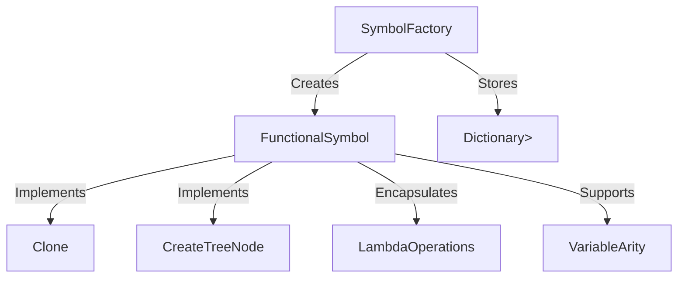
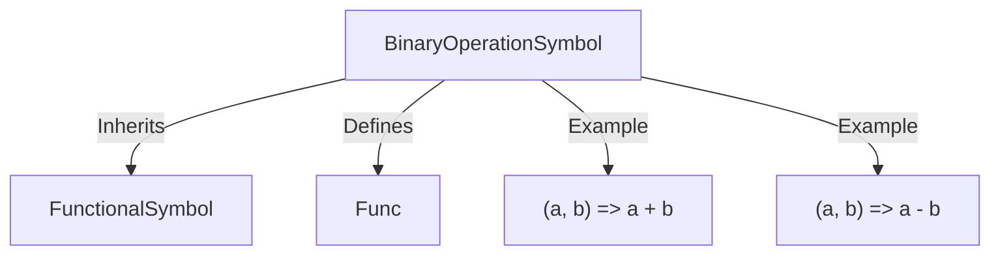

# Solution Design: Functional Symbol Optimization

## Objective
Simplify and optimize the implementation of mathematical symbols using functional programming constructs in C#. Focus on reducing boilerplate code, improving performance, and enhancing maintainability.

## Key Features
1. **FunctionalSymbol Base Class**
   - Encapsulates core operations as lambdas.
   - Implements common methods: `Clone()`, `CreateTreeNode()`, and validation logic.
   - Supports variable arity via `params double[]`.

2. **SymbolFactory**
   - Centralized creation of symbols using fluent API.
   - Stores operations in `Dictionary<string, Func<double[], double>>` for fast lookup.

3. **Lambda-Based Mathematical Symbols**
   - Replace individual classes (Addition, Subtraction, etc.) with generic `BinaryOperationSymbol` and `UnaryOperationSymbol`.
   - Example: `SymbolFactory.CreateBinary("+", (a, b) => a + b)`.

4. **Validation and Domain Checks**
   - Lambdas for domain-specific validation (e.g., prevent division by zero).

5. **Integration with Existing Grammar**
   - Update `SymbolicExpressionTreeGrammar` to support lambda-based symbols.
   - Ensure backward compatibility with existing grammar rules.

### Examples of Lambda-Based Symbols

1. **Addition Symbol**
   ```csharp
   var addition = SymbolFactory.CreateBinary("+", (a, b) => a + b);
   ```

2. **Subtraction Symbol**
   ```csharp
   var subtraction = SymbolFactory.CreateBinary("-", (a, b) => a - b);
   ```

3. **Multiplication Symbol**
   ```csharp
   var multiplication = SymbolFactory.CreateBinary("*", (a, b) => a * b);
   ```

4. **Division Symbol with Validation**
   ```csharp
   var division = SymbolFactory.CreateBinary("/", (a, b) => b != 0 ? a / b : throw new DivideByZeroException());
   ```

5. **Unary Negation Symbol**
   ```csharp
   var negation = SymbolFactory.CreateUnary("-", a => -a);
   ```

## Simplifications
- Skip lazy evaluation, caching, and threading for now.
- Focus only on mathematical symbols; defer tensor/statistical integration.
- Avoid advanced optimizations like SIMD or hot-path compilation.

## Comparison: Old vs New Architecture

| Feature                          | Old Architecture                                   | New Architecture                                   |
|----------------------------------|--------------------------------------------------|--------------------------------------------------|
| **Code Duplication**             | High, with repeated boilerplate across classes   | Reduced by 50-80% using centralized lambdas       |
| **Symbol Implementation**       | Individual classes for each operation            | Generic `FunctionalSymbol` with lambdas          |
| **Validation Logic**            | Duplicated in each symbol class                  | Centralized in `SymbolFactory`                   |
| **Performance**                 | Standard evaluation                              | Optimized with lambda-based operations           |
| **Integration with Grammar**    | Manual updates for each new symbol              | Seamless with lambda-based symbols               |
| **Thread Safety**               | Limited                                          | Improved with immutable lambda-based symbols     |
| **Extensibility**               | Difficult to add new operations                 | Easy with fluent API in `SymbolFactory`          |
| **Maintenance**                 | Complex due to scattered logic                  | Simplified with centralized architecture         |

## Benefits
- Reduces code duplication by 50-80%.
- Simplifies maintenance with centralized symbol definitions.
- Provides a foundation for future enhancements (e.g., lazy evaluation, threading).

## Risks
- Requires careful testing to ensure compatibility with existing systems.
- Initial refactoring effort may introduce temporary instability.

## Next Steps
1. Implement `FunctionalSymbol` and `SymbolFactory`.
2. Refactor existing mathematical symbols to use the new architecture.
3. Update grammar integration and validate compatibility.
4. Write comprehensive unit tests for the new implementation.

## Edge Cases and Mitigations

1. **Division by Zero**
   - **Mitigation**: Add validation lambdas in `SymbolFactory` to check for zero denominators before evaluation.

2. **Invalid Arity**
   - **Mitigation**: Validate the number of arguments passed to symbols using arity checks in `FunctionalSymbol`.

3. **Null or Empty Inputs**
   - **Mitigation**: Add null checks and default handling for input arrays in symbol operations.

4. **Performance Degradation**
   - **Mitigation**: Benchmark new implementation against existing code to ensure no regressions.

5. **Backward Compatibility**
   - **Mitigation**: Maintain compatibility layers in `SymbolicExpressionTreeGrammar` to support legacy symbols.

6. **Thread Safety**
   - **Mitigation**: Ensure immutability of lambda-based symbols and avoid shared mutable state.

## Diagrams

### FunctionalSymbol Architecture


### Example: BinaryOperationSymbol

```